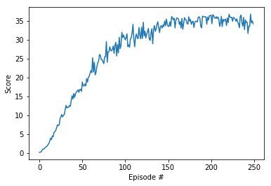
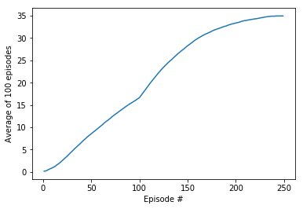

The environment chose to learn 20 agents, the second version


# Learning Algorithm
Basic PPO algorithm with Actor Critic model were implemented and trained.
This model is composed of two networks of Actor Critic type because Continous Action Space is supposed to generate high variance.

Actor network takes an observation of the Unity Agent as an input and outputs an action.
Critic network is used to compute advantage for state value estimation.

# Model Architectures and Hyperparameters

Actor passes the input it passes with no preprocessing and outputs 4 values that are the size of the action space.
Critic is using compute advantages state value.

Hyperparameters were adjusted based on ShangtongZhang's PPO Continuous (https://github.com/ShangtongZhang/DeepRL), which was introduced as the best practice in the lecture, until the score got better.

The layers and hyperparameters used are shown below.

## Actor

- 3 Fully connected layer
    - Fully connected layer - input: 33 (state size) output: 512
    - Fully connected layer - input: 512 output 512
    - Fully connected layer - input: 512 output: (action size -> 4)
    - Each fully connected layer is activated by ReLU and The last one is tanh for make fitting -1~1

## Critic

- 3 Fully connected layer
    - Fully connected layer - input: 33 (state size) output: 512
    - Fully connected layer - input: 512 output 512
    - Fully connected layer - input: 512 output: 1
    - Each fully connected layer is activated by ReLU and The last one does not activate.
    
## Hyperparameters
The all hyperparameters are specified in config.py.

- Optimization epochs = 10
- PPO ratio clip = 0.2
- Rollout length = 2048
- Entropy weight = 0.01
- Gradient Clip = 5
- Mini batch size = 128
- Tau = 0.95
- Discount = 0.99

# Tuning Hyper parameter

I was able to hold a mini batch size at 32 in the beginning, but I cannot exceed 30 points in every episode.
I think it would be better to have a longer Observation time in a continuous environment. I increased to 128 and I could score 37 points.
 
# Plot of Rewards
## PPO with Actor Critic




```
Episode: 1 Total score: 0.12349999723955989 Average Score: nan
...
Episode: 10 Total score: 1.8134999594651162 Average Score: 0.8399444256702231
...
Episode: 20 Total score: 5.959499866794795 Average Score: 2.3313420531536013
...
Episode: 30 Total score: 10.164999772794545 Average Score: 4.380620591740669
...
Episode: 40 Total score: 14.250999681465327 Average Score: 6.439012676589669
...
Episode: 50 Total score: 16.259499636571853 Average Score: 8.371152874114639
...
Episode: 60 Total score: 21.068999529071153 Average Score: 10.09079638462261
...
Episode: 70 Total score: 24.292999457009138 Average Score: 11.86779683618334
...
Episode: 80 Total score: 23.971999464184044 Average Score: 13.578132607897487
...
Episode: 90 Total score: 29.267999345809223 Average Score: 15.090128876192473
...
Episode: 94 Total score: 30.582499316427857 Average Score: 15.62482223140316
...
Episode: 100 Total score: 30.51999931782484 Average Score: 16.49824710598291
...
Episode: 110 Total score: 34.02299923952669 Average Score: 19.253544569649733
...
Episode: 120 Total score: 33.264499256480484 Average Score: 21.983474508631048
...
Episode: 160 Total score: 35.09999921545386 Average Score: 29.705294336034918
Episode: 161 Total score: 35.70499920193106 Average Score: 29.845604332898738
Episode: 162 Total score: 35.613999203965065 Average Score: 29.984779329787944
Episode: 163 Total score: 35.47899920698255 Average Score: 30.128224326581694
Episode: 164 Total score: 34.01449923971668 Average Score: 30.2310843242826
...
Episode: 200 Total score: 36.29649918871 Average Score: 33.31241925540939
...
Episode: 247 Total score: 36.72649917909875 Average Score: 34.94768421885837
Episode: 248 Total score: 34.43499923031777 Average Score: 34.965719218455256
Episode: 249 Total score: 34.948499218840155 Average Score: 34.97343421828281
Episode: 250 Total score: 34.16649923631921 Average Score: 34.968689218388874
```

# Ideas for Future Work

* Implementation DDPG